# Fleet Failure Atlas

[](https://github.com/korovin-aa97/fleet-failure-atlas/actions/workflows/ci.yml)
[](https://korovin-aa97.github.io/fleet-failure-atlas/)
[](LICENSE)
[](https://github.com/korovin-aa97/fleet-failure-atlas/releases)

An executable field guide to autonomous coding-agent failures: reproduce the
symptom, detect it, repair the invariant, and keep it from returning.

Most failure catalogs stop at a story. Fleet Failure Atlas makes each public
entry operational: a bounded synthetic fixture, an observable signature, a
deterministic detector, a repair contract, and a regression proof.

**No package install. No service. No credentials. Python 3.11+ and five
seconds per fixture.**

## See the failure, then prove the defense

```console
$ python3 atlas.py run FFA-001 --mode reproduce
... "vulnerable_gate_accepts": true ...

$ python3 atlas.py run FFA-001 --mode detect
... "detector_findings": ["head_sha_mismatch", "coverage_not_bound_to_head"] ...

$ python3 atlas.py run FFA-001 --mode regress
... "repaired_gate_accepts": false, "fresh_receipt_accepts": true ...
```

The command succeeds when it proves the expected condition. In `reproduce`
mode, that means the deliberately contained failure was reproduced. Run the
dependency-free release gate and unit tests:



```bash
make check
```

## Browse the first collection

| ID | Failure | Look for | Lifecycle |
| --- | --- | --- | --- |
| [FFA-001](patterns/001-stale-green-ci.md) | Stale green CI evidence | Green receipt for the wrong revision | Verification, merge |
| [FFA-002](patterns/002-artifact-poll-deadlock.md) | Result-channel mismatch | Completed worker, waiting parent | Orchestration, handoff |
| [FFA-003](patterns/003-concurrent-queue-loss.md) | Concurrent queue update loss | Accepted stable ID disappears | Coordination, persistence |
| [FFA-004](patterns/004-timezone-test.md) | Timezone-dependent test | Same instant, different date | Testing, verification |

Use the [searchable web atlas](https://korovin-aa97.github.io/fleet-failure-atlas/)
to filter by symptom or lifecycle stage. Agents can consume
[`docs/atlas.json`](docs/atlas.json) or [`llms.txt`](llms.txt).

## Entry anatomy

Every entry follows the [pattern schema](docs/PATTERN_SCHEMA.md):

```text
scope → observable signature → root mechanism
      → safe fixture → detector → repair invariant → regression check
```

Fixtures run offline in fresh temporary directories, receive a minimal
environment, and are killed after five seconds or 64 KiB per output stream. The
runner checks their JSON evidence contract. See
[safety and provenance](docs/SAFETY_AND_PROVENANCE.md) for the exact boundary.

## Regression-review skill

The repository also includes a generic
[`regression-review` agent skill](skills/regression-review/SKILL.md) and the
same [human-readable checklist](regression-review-checklist.md). Validation
fails if their canonical checklists drift.

## What this project deliberately omits

- private incident narratives, customer data, infrastructure names, and
  proprietary orchestration topology;
- unsafe reproductions that require production, network mutation, credentials,
  elevated privileges, or uncontrolled resources;
- unsupported claims about incident frequency, impact, or attribution;
- broad agent capability rankings—the atlas tests failure mechanisms, not which
  model is “best”;
- prose-only anecdotes without a reusable detector and defense contract.

All current patterns are explicitly **hypothetical** clean-room reproductions.
Executable evidence shows the mechanism; it does not imply a named organization
experienced it.

## Contribute a pattern

Read [CONTRIBUTING.md](CONTRIBUTING.md), copy the
[pattern proposal template](.github/ISSUE_TEMPLATE/pattern.yml), and run:

```bash
python3 atlas.py validate
python3 atlas.py safety
python3 -m unittest discover -v
python3 atlas.py run
python3 atlas.py build-site --check
```

CI also runs the pinned development audit in `requirements-dev.txt`: Ruff,
Mypy, Bandit, Python 3.11–3.14 on Linux, and Python 3.11 on Windows.

Each new executable entry needs one fixture that supports `reproduce`, `detect`,
and `regress`. Unsafe fixtures are rejected even when the mechanism is
interesting.

## Project notes

- [Related work and name check](docs/RELATED_WORK.md)
- [Clean-room release inventory](docs/INVENTORY.md)
- [Roadmap](docs/ROADMAP.md)
- [Governance](GOVERNANCE.md)
- [Security policy](SECURITY.md)
- [Changelog](CHANGELOG.md)

The atlas grew from practical reliability questions in autonomous coding-agent
operations, but each public entry must stand on its own reproducible evidence.
Released under the [MIT License](LICENSE).
